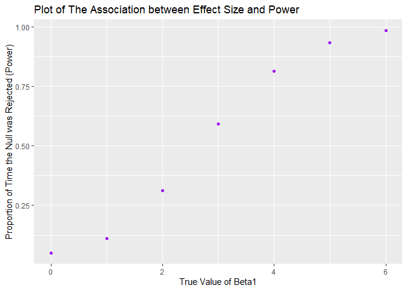
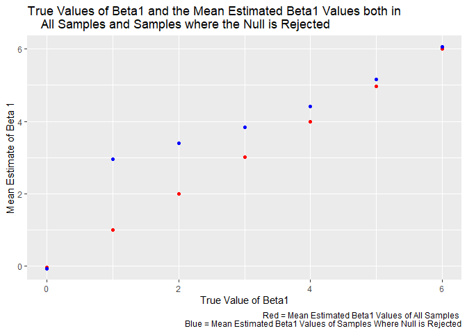

p8105\_hw5\_mrc2229
================
Matthew Curran
November 7, 2019

``` r
library(tidyverse)
```

    ## -- Attaching packages ------------------------------------------------------------------------------------------------ tidyverse 1.2.1 --

    ## v ggplot2 3.2.1     v purrr   0.3.2
    ## v tibble  2.1.3     v dplyr   0.8.3
    ## v tidyr   1.0.0     v stringr 1.4.0
    ## v readr   1.3.1     v forcats 0.4.0

    ## -- Conflicts --------------------------------------------------------------------------------------------------- tidyverse_conflicts() --
    ## x dplyr::filter() masks stats::filter()
    ## x dplyr::lag()    masks stats::lag()

``` r
library(janitor)
```

    ## 
    ## Attaching package: 'janitor'

    ## The following objects are masked from 'package:stats':
    ## 
    ##     chisq.test, fisher.test

``` r
library(rvest)
```

    ## Loading required package: xml2

    ## 
    ## Attaching package: 'rvest'

    ## The following object is masked from 'package:purrr':
    ## 
    ##     pluck

    ## The following object is masked from 'package:readr':
    ## 
    ##     guess_encoding

``` r
library(viridis)
```

    ## Loading required package: viridisLite

``` r
library(broom)
```

Problem 1 - Replace the missing values in the iris data set.
------------------------------------------------------------

``` r
set.seed(10)

iris_with_missing = iris %>% 
  map_df(~replace(.x, sample(1:150, 20), NA)) %>%
  mutate(Species = as.character(Species))

replace_function = function(x) {
  if(is.numeric(x)) {
    replace_na(x, round(mean(x, na.rm = TRUE), digits=1))
  }
  else if(!is.numeric(x)){
    replace_na(x,"virginica")
  }
}

iris_new = map_df(iris_with_missing, ~replace_function(.x))
```

-   The iris\_is\_missing data set has been updated with a function that relpaces missing enteries for numeric variables with the mean of non-missing values and missing character variables are filled in with "virginica". This new dataset is called iris\_new.

Problem 2 - Create a tidy dataframe from a longitudinal study that included a control arm and an experimental arm.
------------------------------------------------------------------------------------------------------------------

``` r
data_function = function(y) {
  data = read.csv(y)
}

long_study_tib = tibble(
  file_name = list.files(path = "./data/"),
  path = str_c("./data/", file_name)
)

long_study = long_study_tib %>%
  mutate(lists = map(path, data_function)) %>%
  unnest(cols=lists)%>%
  mutate(
    subject_id=row_number()
  )%>%
  pivot_longer(
    week_1:week_8,
    names_to = "week",
    values_to = "value"
  ) %>%
  separate(file_name, into = c("study_arm", "id"), sep="_")%>%
  mutate(
    study_arm = recode(study_arm, con = "Control Group", exp = "Experimental Group")
  ) %>%
  select(-path,-id)%>%
  mutate(
    subject_id = str_replace(subject_id, ".csv",""),
    week = str_replace(week,"week_","")
  )

## Make a Spaghetti Plot showing Observations of each Subject over Time

long_study_plot = long_study %>%
  group_by(study_arm, subject_id, week)%>%
  ggplot(aes(x=week,y=value))+
  geom_path(aes(group=subject_id, color=study_arm))+
  scale_color_viridis(
    discrete = TRUE,
    name = "Study Arm"
  )+
  labs(
    title = "Observed Value of each Subject over an 8 Week Period",
    x = "Week Number",
    y ="Values"
  ) 

long_study_plot
```


-   Looking at this Spaghetti Plot, it is apparent that the obsereved values of those in the experimental arm increase over the 8 weeks, while the values of those in the control arm remain roughly the same.

-   In the begining of the study, the mean value of those in the control group was 0.92 and in the experimental group it was1.14.

-   At week 8, the mean value of those in the control group was 0.74 and in the experimental group it was 5.12.

Problem 3: A Simulation to Explore Power in a Simple Linear Regression
----------------------------------------------------------------------

``` r
regression = function(
  n = 30, beta0 = 2, beta1, var =50
) {
  reg_data = tibble(
    x = rnorm(n),
    y = beta0 + beta1*x + rnorm (n, 0, 50^0.5)
  )
  
  reg_fit = lm(y~x, data = reg_data)
  
  tidy(reg_fit)%>%
    filter(term=="x")
}

reg_sim = 
  rerun(10000, regression(beta1 = 0)) %>%
  bind_rows() %>%
  select(estimate, p.value)

reg_sim_repeat = tibble(
  beta1 = c(0, 1, 2, 3, 4, 5, 6)) %>%
  mutate(
    output_list = map(.x = beta1, ~rerun(10000, regression(beta1 = .x))),
    estimate_dfs = map(output_list, bind_rows)) %>%
  unnest(estimate_dfs) %>%
  select(beta1, estimate, p.value)
```

-   The above dataset contains the true values of beta1 and the simulated estimates of beta1 and resulting p-values.

Problem 3: Plot of Effect Size and Power
----------------------------------------

``` r
effect_power = reg_sim_repeat %>%
  mutate(
    null_rejected = cut(p.value, breaks = c(0,0.05,Inf))
    ) %>%
  mutate(
    null_rejected = recode(null_rejected, "(0.05,Inf]" = "Not Rejected", "(0,0.05]" = "Rejected")
  ) %>%
  group_by(beta1) %>%
  summarise(
    number_sig = sum(null_rejected=="Rejected"),
    proportion_sig = number_sig/n()
  ) %>%
  ggplot(aes(x=beta1, y=proportion_sig))+
  geom_point(color="purple")+
  labs(
    title = "Plot of The Association between Effect Size and Power",
    x = "True Value of Beta1",
    y = "Proportion of Time the Null was Rejected (Power)"
  )
effect_power
```



-   The plot of the effect\_power data shos that as the effect size increases, as does the power. The values of the betas (effect size) were directly related to the proportion of the time the null was rejected, or power, in an S shaped curve.

Problem 3: Overlaid Plot of Beta1 Estimates and True Values of Beta1.
---------------------------------------------------------------------

``` r
estimate_all = reg_sim_repeat %>%
  group_by(beta1) %>%
  summarise(
    mean_beta1_est = mean(estimate)
  )

estimate_true = reg_sim_repeat %>%
  mutate(
    null_rejected = cut(p.value, breaks = c(0,0.05,Inf))
    ) %>%
  mutate(
    null_rejected = recode(null_rejected, "(0.05,Inf]" = "Not Rejected", "(0,0.05]" = "Rejected")
  ) %>%
  group_by(beta1) %>%
  filter(null_rejected=="Rejected") %>%
  summarise(
    mean_beta1_est = mean(estimate)
  )

overlay_plot = 
  ggplot(estimate_all, aes(x=beta1, y=mean_beta1_est))+
  geom_point(color="red")+
  geom_point(data = estimate_true, color="blue")+
  labs(
    title = "True Values of Beta1 and the Mean Estimated Beta1 Values both in 
    All Samples and Samples where the Null is Rejected",
    caption = "Red = Mean Estimated Beta1 Values of All Samples 
    Blue = Mean Estimated Beta1 Values of Samples Where Null is Rejected",
    x = "True Value of Beta1",
    y = "Mean Estimate of Beta 1"
  )

overlay_plot
```



-   The above plot shows the values of the true beta on the x-axis and two different measures of the mean estimated betas on the y-axis. The red markers show the values of the mean estimated betas across all samples and the blue markers show the mean estimated betas only for samples where the null was rejected.

-   The mean estimated betas across all samples appears to closer approximate the true values based on this plot, though both mean estimates follow the same general trend of the true betas. The mean estimated betas only for samples where the null was rejected just tends to be higher.

-   This makes sense because, as shown before, effect size is related to power. If we reject the null more frequently, or increase the power, then the effect size will be larger. In this case by taking the mean estimates of only the betas where the null was rejected, we are artificially increasing the power, and therefore increasing the effect size, or betas. This is why the mean estimates of only the betas where the null was rejected tend to be less accurate than the estimated betas of all samples and generally higher than the true betas.
