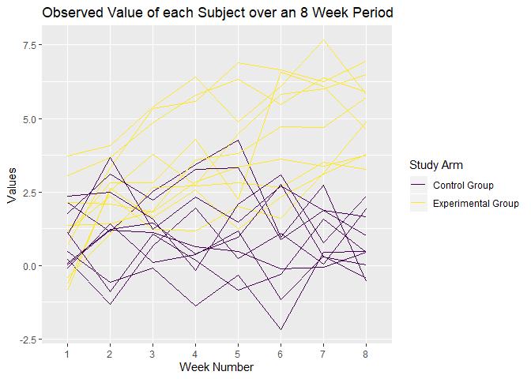

p8105\_hw5\_mrc2229
================
Matthew Curran
November 7, 2019

``` r
library(tidyverse)
```

    ## -- Attaching packages ------------------------------------------------------------------------------------------------ tidyverse 1.2.1 --

    ## v ggplot2 3.2.1     v purrr   0.3.2
    ## v tibble  2.1.3     v dplyr   0.8.3
    ## v tidyr   1.0.0     v stringr 1.4.0
    ## v readr   1.3.1     v forcats 0.4.0

    ## -- Conflicts --------------------------------------------------------------------------------------------------- tidyverse_conflicts() --
    ## x dplyr::filter() masks stats::filter()
    ## x dplyr::lag()    masks stats::lag()

``` r
library(janitor)
```

    ## 
    ## Attaching package: 'janitor'

    ## The following objects are masked from 'package:stats':
    ## 
    ##     chisq.test, fisher.test

``` r
library(rvest)
```

    ## Loading required package: xml2

    ## 
    ## Attaching package: 'rvest'

    ## The following object is masked from 'package:purrr':
    ## 
    ##     pluck

    ## The following object is masked from 'package:readr':
    ## 
    ##     guess_encoding

``` r
library(viridis)
```

    ## Loading required package: viridisLite

``` r
library(broom)
```

Problem 1 - Replace the missing values in the iris data set.
------------------------------------------------------------

``` r
set.seed(10)

iris_with_missing = iris %>% 
  map_df(~replace(.x, sample(1:150, 20), NA)) %>%
  mutate(Species = as.character(Species))

replace_function = function(x) {
  if(is.numeric(x)) {
    replace_na(x, round(mean(x, na.rm = TRUE), digits=1))
  }
  else if(!is.numeric(x)){
    replace_na(x,"virginica")
  }
}

iris_new = map_df(iris_with_missing, ~replace_function(.x))
```

-   The iris\_is\_missing data set has been updated with a function that relpaces missing enteries for numeric variables with the mean of non-missing values and missing character variables are filled in with "virginica". This new dataset is called iris\_new.

Problem 2 - Create a tidy dataframe from a longitudinal study that included a control arm and an experimental arm.
------------------------------------------------------------------------------------------------------------------

``` r
data_function = function(y) {
  data = read.csv(y)
}

long_study_tib = tibble(
  file_name = list.files(path = "./data/"),
  path = str_c("./data/", file_name)
)

long_study = long_study_tib %>%
  mutate(lists = map(path, data_function)) %>%
  unnest(cols=lists)%>%
  pivot_longer(
    week_1:week_8,
    names_to = "week",
    values_to = "value"
  ) %>%
  separate(file_name, into = c("study_arm", "subject_id"), sep="_")%>%
  mutate(
    study_arm = recode(study_arm, con = "Control Group", exp = "Experimental Group")
  ) %>%
  select(-path)%>%
  mutate(
    subject_id = str_replace(subject_id, ".csv",""),
    week = str_replace(week,"week_","")
  )

long_study_plot = long_study %>%
  group_by(study_arm, subject_id, week)%>%
  ggplot(aes(x=week,y=value))+
  geom_path(aes(group=study_arm, color=study_arm))+
  scale_color_viridis(
    discrete = TRUE,
    name = "Study Arm"
  )+
  labs(
    title = "Observed Value of each Subject over an 8 Week Period",
    x = "Week Number",
    y ="Values"
  ) 

long_study_plot
```


